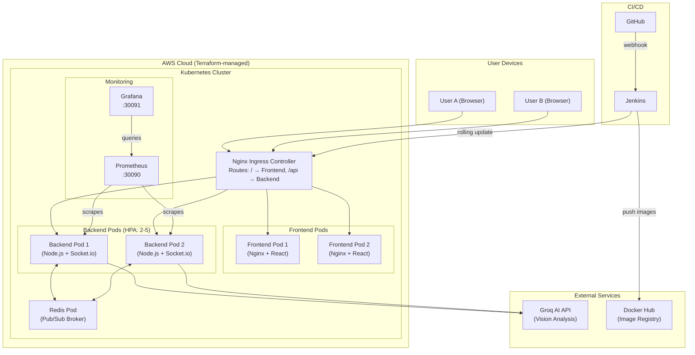

# Naqsh نقش — Cloud-Native Collaborative Whiteboard

A highly scalable, real-time collaborative whiteboard built with a microservices architecture and deployed on AWS using Kubernetes.

> **[Live Demo](https://naqsh-frontend.onrender.com/)** (Render deployment)

---

## Architecture Overview



---

## Technology Stack

| Layer | Technology | Purpose |
|-------|-----------|---------|
| **Frontend** | React 19, HTML5 Canvas, Vite | Real-time drawing UI |
| **Backend** | Node.js, Express 5, Socket.io | REST API + WebSocket server |
| **AI** | Groq (Llama 4 Scout) | Whiteboard image analysis |
| **Message Broker** | Redis + Socket.io Adapter | Multi-pod WebSocket sync |
| **Containerization** | Docker (multi-stage builds) | Consistent deployments |
| **Orchestration** | Kubernetes (kubeadm) | Self-healing, autoscaling |
| **Infrastructure** | AWS EC2, VPC, Terraform | Reproducible cloud infra |
| **CI/CD** | Jenkins | Automated test → build → deploy |
| **Monitoring** | Prometheus + Grafana | Cluster & app observability |

---

## Project Structure

```
naqsh-cloud/
├── backend/                    # Node.js + Express + Socket.io
│   ├── Dockerfile              # Multi-stage production build
│   ├── .dockerignore
│   ├── index.js                # Main server (REST + WebSocket + Redis adapter)
│   └── package.json
├── frontend/                   # React 19 + Vite
│   ├── Dockerfile              # Build with Node → Serve with Nginx
│   ├── .dockerignore
│   ├── nginx.conf              # SPA routing + gzip + caching
│   └── src/
│       ├── App.jsx             # Router: Home, Canvas, AICanvas
│       ├── Canvas.jsx          # Real-time collaborative drawing
│       └── AICanvas.jsx        # AI-powered drawing analysis
├── terraform/                  # Infrastructure as Code
│   ├── main.tf                 # AWS provider config
│   ├── variables.tf            # Configurable parameters
│   ├── vpc.tf                  # VPC, subnets, internet gateway
│   ├── ec2.tf                  # Master + Worker EC2 instances
│   ├── security-groups.tf      # Firewall rules
│   └── outputs.tf              # IP addresses, SSH commands
├── k8s/                        # Kubernetes manifests
│   ├── namespace.yaml          # "naqsh" namespace
│   ├── configmap.yaml          # Environment variables
│   ├── redis.yaml              # Redis Deployment + Service
│   ├── backend.yaml            # Backend Deployment + Service + HPA
│   ├── frontend.yaml           # Frontend Deployment + Service
│   └── ingress.yaml            # Nginx Ingress routing rules
├── monitoring/                 # Observability stack
│   ├── prometheus-config.yaml  # Scrape targets configuration
│   ├── prometheus.yaml         # Prometheus Deployment + Service
│   └── grafana.yaml            # Grafana Deployment + Service
├── docker-compose.yml          # Local dev with Redis
├── Jenkinsfile                 # CI/CD pipeline definition
└── README.md                   # This file
```

---

## Quick Start — Local Development

### Prerequisites
- [Docker Desktop](https://www.docker.com/products/docker-desktop/) installed and running

### Run with Docker Compose
```bash
# Clone the repo
git clone https://github.com/1ShahidBashir/naqsh-cloud.git
cd naqsh-cloud

# Create a .env file with your Groq API key
echo "GROQ_API_KEY=your_groq_api_key_here" > .env

# Build and start all services
docker-compose up --build

# Open in browser:
#   Frontend: http://localhost:5173
#   Backend:  http://localhost:3001
```

### Run without Docker (traditional)
```bash
# Terminal 1 — Backend
cd backend
npm install
node index.js

# Terminal 2 — Frontend
cd frontend
npm install
npm run dev
```

---

## Cloud Deployment Guide

### Prerequisites
- [AWS CLI](https://aws.amazon.com/cli/) configured (`aws configure`)
- [Terraform](https://www.terraform.io/downloads) installed
- An [AWS Key Pair](https://docs.aws.amazon.com/AWSEC2/latest/UserGuide/ec2-key-pairs.html) created in `ap-south-1`

### Step 1: Provision AWS Infrastructure

```bash
cd terraform

# Initialize Terraform (downloads AWS provider)
terraform init

# Preview what will be created
terraform plan -var="key_pair_name=YOUR_KEY_PAIR_NAME"

# Create the infrastructure
terraform apply -var="key_pair_name=YOUR_KEY_PAIR_NAME"

# Note the output IPs:
# master_public_ip = "x.x.x.x"
# worker_public_ip = "y.y.y.y"
```

### Step 2: Initialize Kubernetes Cluster

```bash
# SSH into the master node
ssh -i ~/.ssh/YOUR_KEY.pem ubuntu@MASTER_IP

# On the MASTER — initialize the cluster
sudo kubeadm init --pod-network-cidr=10.244.0.0/16 --apiserver-advertise-address=$(curl -s http://169.254.169.254/latest/meta-data/local-ipv4)

# Set up kubectl for your user
mkdir -p $HOME/.kube
sudo cp /etc/kubernetes/admin.conf $HOME/.kube/config
sudo chown $(id -u):$(id -g) $HOME/.kube/config

# Install Flannel networking
kubectl apply -f https://raw.githubusercontent.com/flannel-io/flannel/master/Documentation/kube-flannel.yml

# Copy the "kubeadm join" command from the output!
# It looks like: kubeadm join IP:6443 --token xxx --discovery-token-ca-cert-hash sha256:xxx
```

```bash
# SSH into the WORKER node
ssh -i ~/.ssh/YOUR_KEY.pem ubuntu@WORKER_IP

# On the WORKER — join the cluster (paste the command from above)
sudo kubeadm join MASTER_PRIVATE_IP:6443 --token xxx --discovery-token-ca-cert-hash sha256:xxx
```

### Step 3: Deploy the Application

```bash
# Back on the MASTER node:

# Install Nginx Ingress Controller
kubectl apply -f https://raw.githubusercontent.com/kubernetes/ingress-nginx/controller-v1.10.0/deploy/static/provider/baremetal/deploy.yaml

# Create the namespace
kubectl apply -f k8s/namespace.yaml

# Create secrets (NEVER put these in Git!)
kubectl create secret generic naqsh-secrets \
  --from-literal=GROQ_API_KEY=your_groq_api_key_here \
  -n naqsh

# Deploy everything
kubectl apply -f k8s/configmap.yaml
kubectl apply -f k8s/redis.yaml
kubectl apply -f k8s/backend.yaml
kubectl apply -f k8s/frontend.yaml
kubectl apply -f k8s/ingress.yaml

# Deploy monitoring
kubectl apply -f monitoring/prometheus-config.yaml
kubectl apply -f monitoring/prometheus.yaml
kubectl apply -f monitoring/grafana.yaml

# Check all pods are running
kubectl get pods -n naqsh
```

### Step 4: Access the Application

| Service | URL |
|---------|-----|
| **NAQSH App** | `http://MASTER_IP` |
| **Prometheus** | `http://MASTER_IP:30090` |
| **Grafana** | `http://MASTER_IP:30091` (login: admin/admin) |

---

## CI/CD with Jenkins

1. Install Jenkins on the master node or a separate server
2. Install plugins: **Docker Pipeline**, **Kubernetes CLI**
3. Add credentials in Jenkins:
   - `dockerhub-creds`: Your Docker Hub username/password
   - `kubeconfig`: Upload `~/.kube/config` from the master
4. Create a Pipeline job pointing to this repo's `Jenkinsfile`
5. Set up a GitHub webhook: `http://JENKINS_IP:8080/github-webhook/`

Now every push to `main` automatically deploys!

---

## Tear Down

```bash
# Remove all Kubernetes resources
kubectl delete namespace naqsh

# Destroy AWS infrastructure (stops billing)
cd terraform
terraform destroy -var="key_pair_name=YOUR_KEY_PAIR_NAME"
```

---

## License

ISC
